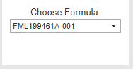

# Welcome to AJAY_MkDocs

For full documentation visit [mkdocs.org](https://en.wikipedia.org/wiki/List_of_HTTP_status_codes).

Informational| Success       | Redirection  |  Client Error | Server Error  | 
:----------- | :------------ | :----------- |  :----------- | :------------ |
100 Continue | 200 OK        | 300 Multiple Choices |  400 Bad Request      | 500 Internal Server Error  | 
101 Switching Protocols |201 Created         | 301 Moved Permanently  |  401 Unauthorized       | 501 Not Implemented  | 
102 Processing|202 Accepted  | 302 Found  | 402 Payment Required      | 502 Bad Gateway   | 
-			 |203 Non-authoritative Information | 303 See Other |  403 Forbidden      | 503 Service Unavailable |
-			 |204 No Content | 304 Not Modified |  404 Not Found      | 504 Gateway Timeout |
-			 |205 Reset Content |305 Use Proxy            | 405 Method Not Allowed               | 505 HTTP Version Not Supported
-			 |206 Partial Content |306  Switch Proxy |406 Not Acceptable                    | 506 Variant Also Negotiates
-			 |207 Multi-Status   |  307 Temporary Redirect| 407 Proxy Authentication Required    | 507 Insufficient Storage
-			 |208 Already Reported | 308 Permanent Redirect  | 408 Request Timeout					 | 508 Loop Detected
-			 |226 IM Used          | -                    | 409 Conflict	                     | 510 Not Extended
- | -| -													| 410 Gone							 | 511 Network Authentication Required
- | -| -															| 411 Length Required        | 599 Network Connect Timeout Error
- | -| -															| 412 Precondition Failed
- | -| -															| 413 Payload Too Large
- | -| -															| 414 Request-URI Too Long
- | -| -															| 415 Unsupported Media Type
- | -| -															| 416 Requested Range Not Satisfiable
- | -| -															| 417 Expectation Failed
- | -| -															| 418 I'm a teapot
- | -| -															| 421 Misdirected Request
- | -| -															| 422 Unprocessable Entity
- | -| -															| 423 Locked
- | -| -															| 424 Failed Dependency
- | -| -															| 426 Upgrade Required
- | -| -															| 428 Precondition Required
- | -| -															| 429 Too Many Requests
- | -| -															| 431 Request Header Fields Too Large
- | -| -															| 444 Connection Closed Without Response
- | -| -															| 451 Unavailable For Legal Reasons
- | -| -															| 499 Client Closed Request

